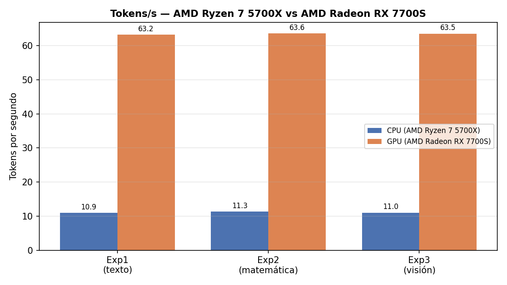
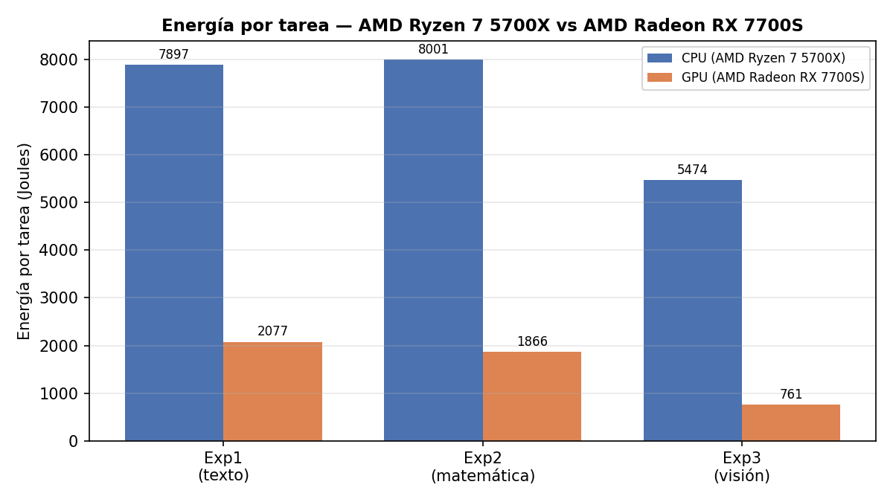
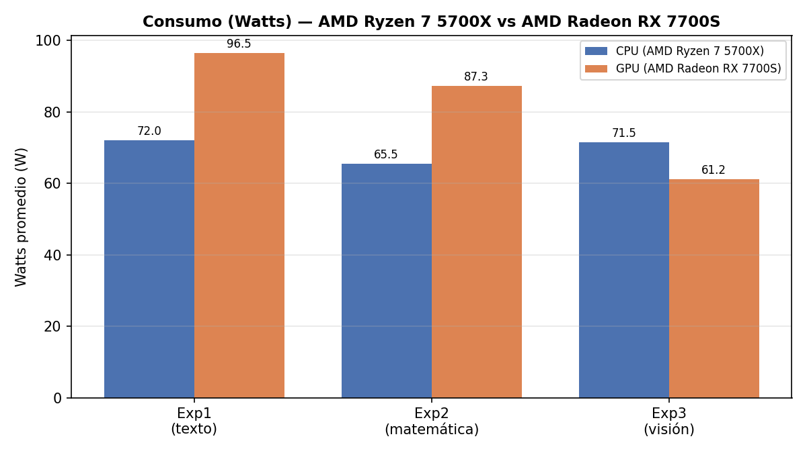

# Informe — Benchmarking de Inferencia LLM: CPU vs GPU
**Prueba 3 — Arquitectura de Computadores (INFO128)**
**Estudiante:** David Minder

---

## Hardware

- **CPU:** AMD Ryzen 7 5700X — 8 núcleos / 16 hilos, frecuencia base 3.4 GHz (boost hasta ~4.6 GHz).
- **GPU:** AMD Radeon RX 7700S (arquitectura RDNA3 / Navi 33), 8 GB VRAM (GDDR6).
- **RAM:** 31 GB (utilizables).
- **Placa madre:** ASRock B550 Phantom Gaming 4.
- **Sistema operativo:** Ubuntu (kernel 6.17).
- **Stack GPU:** ROCm (la GPU fue detectada automáticamente por Ollama, sin necesidad de `HSA_OVERRIDE_GFX_VERSION`).

---

## Modelo

- **Nombre:** gemma3:4b (Google Gemma 3, 4 mil millones de parámetros).
- **Cuantización:** Q4_K_M.  
- **Tamaño en disco:** ~2.9 GB (cuantizado).
- **Tamaño en memoria durante inferencia:** ~2.9 GB en VRAM (GPU) / ~3.5 GB en RAM (CPU).
- Se utilizó el modelo solicitado por el enunciado sin sustituciones. Para forzar ejecución CPU-only se creó un modelo derivado `gemma3-cpu` (ver Metodología).

---

## Metodología
primero cree un repo en github y subi el material https://github.com/Minderr8/pp3_arqui_davidminder, me descarge Ollama con el comando: `curl -fsSL https://ollama.com/install.sh | sh` , revise mi GPU con: `lspci | grep -i vga`, mi RAM con: `free -h`, mi CPU con: `lscpu`, luego descarge el modelo de IA gemma3:4b con Ollama usando: `ollama pull gemma3:4b` , el cual descarga los pesos (3-4GB) y los guarda en ~/.ollama/models dejandolo listo para correr.

para confirmar la instalacion del modelo aplique el comando: `ollama list`, luego para verificar si Ollama detecta mi GPU sin hacer nada en una terminal uso el modelo con: `ollama run gemma3:4b "hola"` y en otra terminal en paralelo con: `ollama ps`, y confirmo que ollama detecta mi GPU sin problemas

para monitorear, primero actualizo los repositorios antes de todo `sudo apt update`, luego descargo la herramienta para medicion de los experimentos `sudo apt install lm-sensors linux-tools-common linux-tools-generic`,luego detecto los sensores del sistema `sudo sensors-detect`, y verifico que el sensor detecte el chip amdgpu (GPU) y k10temp (CPU) con `sensors`,luego verifico que `sudo turbostat --interval 2` muestre PKgwatt y Busy% ,descargo `sudo apt install rocm-smi` para utilizarlo para ver como se usa la GPU en vivo, en porcentaje, esto no lo requeria el trabajo pero fue para aprendizaje personal.

antes de empezar con los experimentos organize las carpetas del proyecto, cree la carpeta screenshots, donde voy a ir almacenando las mediciones de cada experimento en GPU y CPU.

En el experimento 1, para la primera vez que tuve que forzar las corridas con solo la CPU, investigué que Ollama por defecto usa la variable de entorno para detectar GPUs y si se las escondes seteándola a vacía, Ollama no la ve y corre todo en CPU, en mi caso es el comando ROCR_VISIBLE_DEVICES="" ollama run gemma3:4b --verbose porque uso AMD, pero no me funciono y con ayuda de la IA (claude version chat bot, no cowork ni code), me recomendo este comando HIP_VISIBLE_DEVICES="" y tampoco me funciono, por lo que investigué se debia a que Ollama corre como servicio systemd persistente en segundo plano, y ese proceso no re-lee las variables de entorno de mi shell haciendo que setearlas en la terminal no tenga efecto, para chequear si funciona debo ver si Ollama NO esta usando la GPU con `ollama ps` verifico eso, entonces claude me oriento me dijo `Ollama tiene un parámetro num_gpu que le dice cuántas "capas" del modelo debe cargar en GPU. Si lo pones en 0, todo corre en CPU sin importar qué GPU tengas ni qué variable de entorno use el vendor`, me ayudo a copiar el modelo de gemma3 pero con el parametro num_gpu 0,primero creo el Modelfile con:

`echo 'FROM gemma3:4b`

`PARAMETER num_gpu 0' > Modelfile-cpu`

(FROM y PARAMETER en lineas separadas), segundo creo el modelo clonado `ollama create gemma3-cpu -f Modelfile-cpu`,lo que hace esto es forzar a nivel de configuracion del modelo, luego medi el uso de GPU y no habia, todo corria en CPU, para hacer correr este modelo clonado `ollama run gemma3-cpu --verbose`,el cual reutiliza los mismo pesos que el original, no se descarga nada nuevo.

Una observacion durante la configuracion que note, que al inicio empeze usando el modelo en version interactivo, con el comando:`ollama run gemma3:4b --verbose` ,y la primera vez hice el run 1 y el run 2 en el mismo chat, lo que hizo fue que el run 2 se noto que gasto mucho mas tokens debido a que tuvo que recordar lo hablado en la conversación, aunque el prompt no lo pedia.

Luego me arme mi plan de ejecucion para cada experimento que consistia en 4 terminales en paralelo, una era opcional para poder ver el uso de la GPU en vivo, dos eran para monitorear, y la ultima para correr el modelo con los promts.

Terminal opcional corria el comando: watch -n 1 rocm-smi , puedo monitorear el uso real de la gpu en %

terminales de monitoreo: 
```bash
sudo turbostat --interval 2 --out ~/Escritorio/pp3_arqui_davidminder/Informe/Screenshots/EXP1_2/exp1_gpu_run1_turbostat.log
```

```bash
while true; do date +%s; sensors; sleep 2; done > ~/Escritorio/pp3_arqui_davidminder/Informe/Screenshots/EXP1_2/exp1_gpu_run1_sensors.log
```

esto lo que hacia era crear un archivo con lo que paso en el transcurso de las corridas.


### Modelos y modo de ejecución

- **GPU:** `ollama run gemma3:4b --verbose "<prompt>"`
- **CPU:** `ollama run gemma3-cpu --verbose "<prompt>"`

**Cómo se forzó CPU-only:** las variables de entorno (`CUDA_VISIBLE_DEVICES`, `ROCR_VISIBLE_DEVICES`, `HIP_VISIBLE_DEVICES`) NO funcionaron, porque Ollama corre como servicio systemd persistente (`ollama serve`) que no re-lee las variables de la shell. La solución fue crear un modelo derivado mediante un Modelfile con el parámetro `PARAMETER num_gpu 0`:

```
ollama create gemma3-cpu -f Modelfile-cpu
```

Se verificó con `ollama ps` que mostrara `100% CPU` antes de cada corrida CPU (y `100% GPU` en las corridas GPU).

### Herramientas de medición (una por familia de métrica)

| Métrica | Herramienta | Detalle |
|---|---|---|
| Tokens/s, tiempo, tokens generados | `ollama --verbose` | Campos `eval rate`, `total duration`, `eval count` |
| Watts CPU (package) + carga por core | `turbostat --interval 2` | Columnas `PkgWatt` y `Busy%` |
| Watts GPU (PPT) + temperaturas | `sensors` (driver amdgpu) | Campo `PPT`, `junction`, `edge`, `mem`; CPU vía `k10temp` (`Tctl`) |
| Utilización GPU en vivo | `rocm-smi` | Monitoreo visual durante corridas |
| VRAM | `rocm-smi --showmeminfo vram` + `ollama ps` | Memoria usada del driver y del modelo |
| RAM | `free -h` | Diferencia de columna `usado` antes/después de cargar el modelo |

Cada experimento se ejecutó **3 veces por dispositivo** (3 GPU + 3 CPU) con `turbostat` y `sensors` corriendo en paralelo en terminales separadas. Los watts y temperaturas se promediaron sobre todos los intervalos de 2 s de cada corrida.

### Prompts utilizados

- **Experimento 1 (texto largo):** ensayo de mínimo 500 palabras sobre la jerarquía de memoria.
- **Experimento 2 (razonamiento matemático):** distribución óptima de 100 tareas entre 3 servidores, con desarrollo paso a paso.
- **Experimento 3 (multimodal/visión):** descripción detallada de la imagen `imagen_test.png`.

### Cálculos derivados

- **TFLOPS efectivos:** `2 × N_params × (tokens/s)`, con N = 4×10⁹.
- **Eficiencia energética:** `GFLOPS efectivos / watts`.
- **Energía por tarea:** `watts × tiempo_total`.
- **Utilización:** `TFLOPS efectivos / TFLOPS peak teórico` (RX 7700S: 20.5 vectorial / 41 matricial FP16).

> **Nota de rigor:** los TFLOPS y la energía son estimaciones de orden de magnitud (N redondeado, watts promediados, tiempos aproximados). Son suficientes para las conclusiones cualitativas, no pretenden ser medidas exactas.

---

## Resultados

### Tabla comparativa (promedios de 3 corridas)

| Métrica | Exp1 GPU | Exp1 CPU | Exp2 GPU | Exp2 CPU | Exp3 GPU | Exp3 CPU |
|---|---|---|---|---|---|---|
| Tokens/s | 63.21 | 10.94 | 63.64 | 11.35 | 63.53 | 11.02 |
| Tiempo total (s) | 21.52 | 109.68 | 21.37 | 122.15 | 12.44 | 76.56 |
| Tokens generados | 1246 | 1175 | 1231 | 1362 | 635 | 741 |
| Watts GPU (PPT) | 96.5 | 6.1* | 87.3 | 5.1* | 61.2 | 5.2* |
| Watts CPU (Pkg) | 59.5 | 72.0 | 39.8 | 65.5 | 58.9 | 71.5 |
| Temp GPU junction avg (°C) | 77.1 | — | 73.5 | — | 67.6 | — |
| Temp GPU max (°C) | 98 | — | 98 | — | 96 | — |
| Carga CPU (Busy%) | 24.7 | 63.2 | 10.7 | 48.8 | 22.4 | 60.2 |

*\*GPU en reposo durante corridas CPU (confirma que no participó).*

### Métricas derivadas

| | GPU | CPU |
|---|---|---|
| TFLOPS efectivos | 0.508 | 0.088 |
| Utilización vs peak vectorial (20.5) | 2.48% | — |
| Utilización vs peak matricial (41) | 1.24% | — |
| Eficiencia (tok/s por watt) | 0.69 | 0.157 |
| Energía por tarea Exp1 (J) | ~1932 | ~7700 |

### Speedup GPU vs CPU (tokens/s)
- Exp1: 5.78x · Exp2: 5.61x · Exp3: 5.76x → **~5.7x constante en las 3 tareas.**

### Memoria
- VRAM ocupada por el modelo (`ollama ps`): **2.9 GB**
- VRAM total en uso (`rocm-smi`, incluye escritorio): **4.97 GB** de 8.57 GB
- RAM ocupada por el modelo en CPU (`free -h`): **~3.5 GB**







---

## Análisis

### 1. La paradoja cómputo vs. memoria (hallazgo central)
*Datos:* la GPU solo alcanza ~2.5% de su capacidad de cómputo teórica (0.508 de 20.5 TFLOPS), y aun así es ~5.7x más rápida que la CPU.

Al ver que a la GPU le sobra un 97% de su poder de cálculo, está claro que hay algo que la está limitando, y es el ancho de banda de memoria, ya que para cada token generado hay que leer los 2.9GB de pesos completos, haciendo que se pase más tiempo trayendo datos que calculando, la GPU no gana por tener más capacidad de cómputo, sino porque su VRAM entrega los datos más rápidos que la RAM de la CPU. De hecho, esa relación de velocidad de memoria (~5-6x) coincide con el speedup que medí (~5.7x), lo que confirma que el rendimiento lo determina la memoria y no el cómputo.

### 2. Speedup constante independiente de la tarea
*Datos:* ~5.7x en las 3 tareas (ensayo, matemática, visión), pese a ser cognitivamente muy distintas.

Otro hallazgo es que el speedup GPU vs CPU se mantuvo casi igual en los tres experimentos (~5.7x), aunque las tareas eran muy distintas: un ensayo, un problema matemático y una descripción de imagen. Esto se entiende al ver qué mide el eval rate: el costo de generar un token es siempre una pasada por la red (una multiplicación de matrices), y esa operación es estructuralmente la misma sin importar si el token es parte de una ecuación o de una oración. Por eso el speedup no depende del tipo de contenido, sino de la relación de hardware entre la memoria de la GPU y la de la CPU, que es constante.


### 3. Diferencias arquitectónicas CPU vs GPU (SIMT vs SIMD)

Como vimos en clases, se sabe que la GPU tiene muchos más nucleos que la CPU, pero la diferencia principal es cómo se ejecutan las instrucciones, fueron diseñadas para problemas distintos. La CPU pensada para la latencia, pocos nucleos potentes que tratan de terminar la tarea lo antes posible,con paralelismo de dato limitado (SIMD), en cambio la GPU se enfoca para throughput,miles de núcleos simples que ejecutan la misma instruccion en datos distintos en paralelo (SIMT), prioriza la cantidad de trabajo por segundo.Como un LLM pasa la mayoría del tiempo haciendo multiplicaciones de matrices y en esta hay millones de operaciones completamente independientes que se pueden ejecutar en paralelo encajando perfectamente al problema que resuelve la GPU. Aun así, mis datos muestran que en batch=1 la GPU ni siquiera satura sus núcleos (2.5% de uso): tiene la arquitectura, pero el cuello de botella de memoria del punto 1 impide aprovecharla del todo.

### 4. Ley de Amdahl en la práctica
*Datos:* durante las corridas GPU, `turbostat` mostró UN core lógico saltando a ~90-100% mientras el resto quedaba ocioso (Busy% global bajo, ~10-25%).

Como vimos en clases la idea de la Ley de Amdahl  "No importa cuántos procesadores agregues; si una parte del programa sigue siendo secuencial, esa parte terminará limitando la velocidad total.", para responder tenemos que ver que hace el LLM cuando le pasamos el prompt, la GPU acelera cálculos masivos (parte paralela) y la CPU coordina el proceso (la parte secuencial). Cuando el turbostat muestra un núcleo al 100% y el resto casi desocupado, quiere decir que un hilo principal hace todo el trabajo secuencial mientras la GPU el trabajo masivamente paralelo.Entonces, aunque la GPU sea infinitamente rápida, ese hilo seguirá existiendo y siempre tendrá esa parte secuencial que pondrá ese techo a la aceleracion total.

### 5. Eficiencia energética contraintuitiva
*Datos:* la GPU consume más watts instantáneos (92 vs 70) pero es 4.4x más eficiente (0.69 vs 0.157 tok/s/W) y gasta 4x menos energía total por tarea (1932 vs 7700 J).

Hay que separar dos cosas que se confunden: la potencia (watts), que es lo que se consume en cada instante, y la energía total (joules), que es watts × tiempo, o sea lo que cuesta la tarea completa. La GPU consume más watts (92 vs 70), pero como termina la respuesta ~5.7x más rápido, acumula ese consumo por mucho menos tiempo, y al final gasta bastante menos energía total (1932 J vs 7700 J en el Exp1). Además, en eficiencia produce 0.69 tokens por segundo por watt contra 0.157 de la CPU, casi 4.4x mejor. Así que la CPU pierde por partida doble: es menos eficiente por cada watt que gasta y encima tarda mucho más, por lo que su consumo total se dispara.


### 6. Determinismo del output y especificidad del prompt (Exp2)
*Datos:* el prompt sin límite de longitud produjo ~40% de variación en tokens generados entre corridas (958-1607), vs <1% en Exp1 (que pedía "mínimo 500 palabras").

En el Experimento 2 noté que la cantidad de tokens generados variaba mucho entre corridas (de 958 a 1607, ~40% de diferencia), mientras que en el Experimento 1 la variación era menor al 1%. La diferencia está en el prompt: el del Exp1 pedía "al menos 500 palabras", un límite numérico claro, mientras que el del Exp2 solo decía "muestra todo el desarrollo paso a paso", una instrucción cualitativa. Sin un límite concreto, el modelo decide cuánto extenderse en cada corrida, lo que produce más varianza. Esto importa para diseñar benchmarks reproducibles: mientras más específica la instrucción, más consistente es la salida.

### 7. Jerarquía de memoria observable (Exp3, page cache)
*Datos:* en Exp3 la corrida 1 fue notablemente más lenta en `load`+`prompt eval` que las corridas 2-3, en AMBOS dispositivos.

En el Experimento 3 la primera corrida fue notablemente más lenta en las fases de carga y prompt eval que las corridas 2 y 3, y esto pasó tanto en GPU como en CPU. La razón es el page cache del kernel de Linux: la primera vez, el sistema tiene que leer la imagen y esas partes del modelo desde el disco (NVMe), pero después esos datos quedan guardados en RAM, así que las corridas siguientes ya no tocan el disco y son más rápidas. Es la jerarquía de memoria (disco → RAM) haciéndose visible en la práctica, y se podría verificar vaciando el cache con drop_caches y repitiendo la primera corrida.


### 8. Costo de la imagen en tokens (Exp3, opcional)
*Datos:* el `prompt eval count` saltó a ~321-326 tokens en Exp3 vs 108 en Exp2. Una imagen en gemma3 ≈ 256 tokens de contexto.

También noté que el prompt eval count del Exp3 subió a ~321-326 tokens, muy por encima de los 108 del Exp2, aunque el texto del prompt era parecido. Esto se debe a que gemma3 codifica una imagen como un bloque fijo de aproximadamente 256 tokens de contexto. Es decir, procesar una entrada multimodal tiene un costo de entrada mucho mayor que solo texto, lo que explica por qué la fase de prompt eval del experimento de visión es más pesada.

---

## Conclusiones

1. La GPU supera a la CPU por ~5.7x en velocidad de generación, de forma consistente en las tres tareas.

2. El cuello de botella real de la inferencia con un solo prompt (batch=1) es el ancho de banda de memoria, no la capacidad de cómputo: la GPU usa solo ~2.5% de sus TFLOPS teóricos.

3. La GPU es además más eficiente energéticamente: 4.4x más tokens por watt y 4x menos energía total por tarea, pese a consumir más watts instantáneos.

4. La ventaja de la GPU viene de su arquitectura masivamente paralela (SIMT, miles de núcleos) y su mayor ancho de banda, no del tipo de tarea.

5. Parte del proceso sigue siendo secuencial y corre en la CPU (tokenización, sampling, orquestación), lo que pone un techo a la aceleración según la Ley de Amdahl, visible en el núcleo solitario al 100%.

6. Aprendí que el hardware especializado gana no por fuerza bruta de cálculo, sino por mover los datos más rápido: en estas cargas, la memoria manda sobre el cómputo.